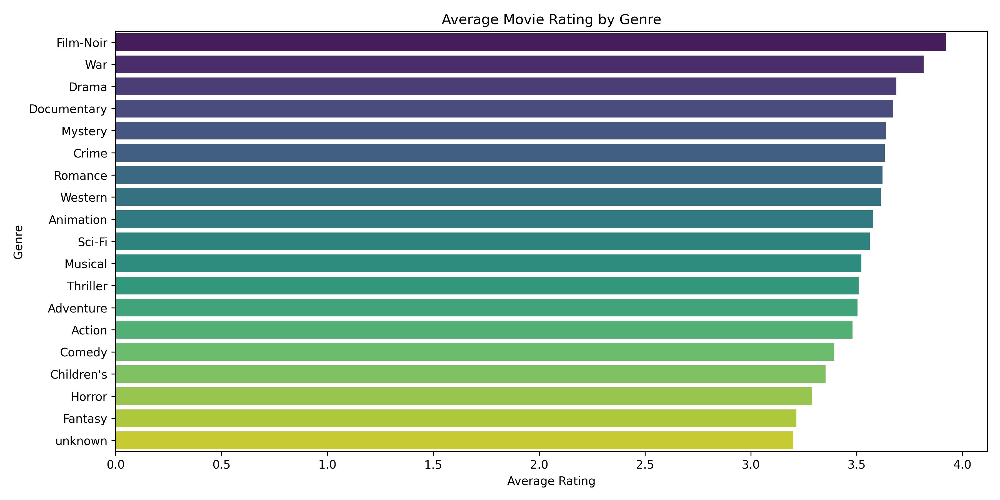

# Movie Ratings Data Analysis

## Overview
This project analyzes the MovieLens 100k dataset, which contains 100,000 ratings from 1,000 users on 1,700 movies. The goal is to uncover trends in movie ratings through data cleaning, exploratory analysis, and insightful queries.

## Project Structure
movie-ratings-project/
├── .ipynb_checkpoints/ # Auto-saved Jupyter backups
├── .venv/ # Virtual environment
├── data/ # Raw dataset files
│ ├── u.data
│ ├── u.genre
│ ├── u.info
│ ├── u.item
│ ├── u.occupation
│ └── u.user
├── images/ # Visualisation (ERD diagram)
│ └── average_rating_by_genre.png
│ └── movie-erd.drawio.jpg
├── notebooks/ # Jupyter notebooks for analysis
│ ├── .ipynb_checkpoints/
│ └── 01-data-exploration.ipynb
├── .gitattributes 
├── .gitignore 
├── LICENSE
├── README.md # Project overview and documentation
└── requirements.txt # Python dependencies

## Tech Stack
- Python 3.13 – Core programming language used for data analysis
- Pandas – For data loading and manipulation
- NumPy – For numerical operations
- Matplotlib & Seaborn – For data visualization
- Draw.io (diagrams.net) – for creating the Entity-Relationship Diagram (ERD)
- Jupyter Notebook – For interactive data exploration and presentation
- VS Code – Primary code editor
- Git – Version control

## Data Schema Design
The MovieLens 100k dataset is represented using a simple relational schema with three main entities: `Users`, `Movies`, and `Ratings` inside the images/movie-erd.drawio.jpg folder.

### 1. Users Table
Stores demographic information about each user.

| Column      | Data Type | Description             |
|-------------|-----------|-------------------------|
| user_id     | Integer   | Primary key             |
| age         | Integer   | Age of the user         |
| gender      | String    | Gender (M/F)            |
| occupation  | String    | User's occupation       |
| zip_code    | String    | ZIP/postal code         |

### 2. Movies Table
Contains details about each movie, including its title and genre flags.

| Column       | Data Type | Description                            |
|--------------|-----------|----------------------------------------|
| movie_id     | Integer   | Primary key                            |
| title        | String    | Movie title                            |
| release_date | String    | Date the movie was released            |
| imdb_url     | String    | Link to IMDb page                      |
| genre flags  | Binary    | Multiple columns (0/1) for each genre  |.*

### 3. Ratings Table
Contains user-generated movie ratings.

| Column     | Data Type | Description                      |
|------------|-----------|----------------------------------|
| user_id    | Integer   | Foreign key to Users table       |
| movie_id   | Integer   | Foreign key to Movies table      |
| rating     | Integer   | Rating score (1 to 5)            |
| timestamp  | Integer   | Time the rating was made         |

### Relationships
- Each `rating` record connects one `user` to one `movie`.
- `user_id` and `movie_id` in the Ratings table are foreign keys referencing `Users.user_id` and `Movies.movie_id`.

## Key Findings
1. Top 5 Movies by Average Rating with at least 50 ratings:

| Title                              | Average Rating | Number of Ratings |
|-----------------------------------|----------------|-------------------|
| Close Shave, A (1995)             | 4.49           | 112               |
| Schindler's List (1993)           | 4.47           | 298               |
| Wrong Trousers, The (1993)        | 4.47           | 118               |
| Casablanca (1942)                 | 4.46           | 243               |
| Wallace & Gromit: Best of Aardman | 4.45           | 67                |

2. Most Liked Genres by Average Rating:

| Genre       | Average Rating |
|-------------|----------------|
| Film-Noir   | 3.92           |
| War         | 3.82           |
| Drama       | 3.69           |
| Documentary | 3.67           |
| Mystery     | 3.64           |
| Crime       | 3.63           |
| Romance     | 3.62           |
| Western     | 3.61           |
| Animation   | 3.58           |
| Sci-Fi      | 3.56           |
| Musical     | 3.52           |
| Thriller    | 3.51           |
| Adventure   | 3.50           |
| Action      | 3.48           |
| Comedy      | 3.39           |
| Children’s  | 3.35           |
| Horror      | 3.29           |
| Fantasy     | 3.22           |
| unknown     | 3.20           |


3. Average Rating by Gender:
- Female users gave an average rating of 3.531507
- Male users gave an average rating of 3.529289

4. Number of Users in Each Age Group:

| Age Group | Number of Users |
|-----------|-----------------|
| 0-18      | 36              |
| 19-30     | 373             |
| 31-45     | 329             |
| 46-60     | 174             |
| 60+       | 31              |

5. Average Rating by Occupation:
Users with occupations such as unemployed (3.78), lawyer (3.74), and doctor (3.69) tend to give higher average movie ratings. Occupations like healthcare (2.90), homemaker (3.30), and executive (3.35) rate movies comparatively lower on average. This suggests that different professional backgrounds may influence movie rating behavior.

6. Most Rated Movies:

| Movie Title                 | Number of Ratings |
|-----------------------------|-------------------|
| Star Wars (1977)            | 583               |
| Contact (1997)              | 509               |
| Fargo (1996)                | 508               |
| Return of the Jedi (1983)   | 507               |
| Liar Liar (1997)            | 485               |
| English Patient, The (1996) | 481               |
| Scream (1996)               | 478               |
| Toy Story (1995)            | 452               |
| Air Force One (1997)        | 431               |
| Independence Day (1996)     | 429               |

## How to Run This Project
1. Clone the repository  
2. Create and activate the virtual environment  
3. Install dependencies from `requirements.txt`  
4. Open the Jupyter notebook in `notebooks/` to explore the analyses step-by-step  
5. Place data files in the `data/` folder  

## License
This project is licensed under the MIT License.  
See the [LICENSE](LICENSE) file for more details.

## Dependencies
- Python 3.x  
- pandas  
- matplotlib  
- seaborn  
- Jupyter Notebook

Install dependencies with:
```bash
pip install -r requirements.txt
